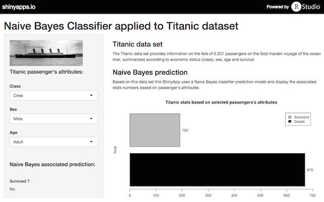
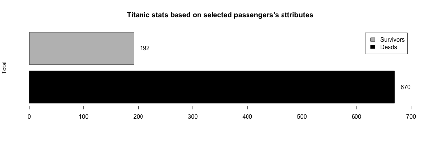

## The Titanic Shiny App

Shiny App: [https://romain-jacotin.shinyapps.io/titanic/](https://romain-jacotin.shinyapps.io/titanic/)  

Source code: [https://github.com/romain-jacotin/titanic](https://github.com/romain-jacotin/titanic/)  



---

## Titanic data set

The Titanic data set provides information on the fate of 2.201 passengers on the fatal maiden voyage of the ocean liner, summarized according to economic status (class), sex, age and survival.


```r
data(Titanic)
str(Titanic)
```

```
##  table [1:4, 1:2, 1:2, 1:2] 0 0 35 0 0 0 17 0 118 154 ...
##  - attr(*, "dimnames")=List of 4
##   ..$ Class   : chr [1:4] "1st" "2nd" "3rd" "Crew"
##   ..$ Sex     : chr [1:2] "Male" "Female"
##   ..$ Age     : chr [1:2] "Child" "Adult"
##   ..$ Survived: chr [1:2] "No" "Yes"
```

---

## Naive Bayes Classifier

Let's create a Naive Bayes classifier on this data set:


```r
mod <- naiveBayes(Survived ~ ., data = Titanic)
```

Then we can use this model to make a prediction: <B> Can a Crew's Male Adult survive ? </B>


```r
df <- as.data.frame(Titanic)
test <- df[df$Class=="Crew" &
           df$Sex=="Male" &
           df$Age=="Adult" &
           df$Survived=="Yes",1:3]
result <- predict(mod, test)
levels(result)[result]
```

```
## [1] "No"
```

---

## Barplot of the Titanic stats


```r
selectedData <- df[df$Class=="Crew" & df$Sex=="Male" & df$Age=="Adult",5]
bplt <- barplot(selectedData, beside=TRUE, horiz=TRUE, xlim=c(0,700),
                main="Titanic stats based on selected passengers's attributes",
                ylab="Total", col=c("black", "grey"), legend = c("Deads", "Survivors"))
text(x=selectedData+20, y=bplt, labels=as.character(selectedData), xpd=TRUE)
```

 

